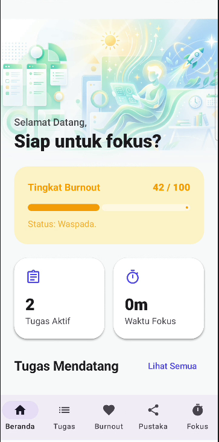
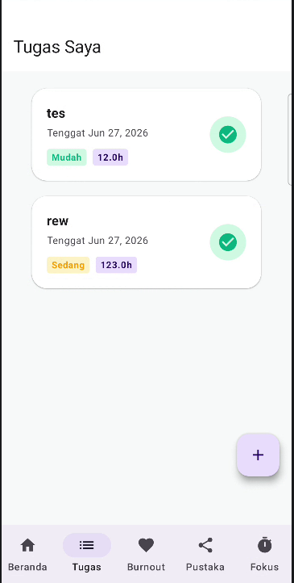
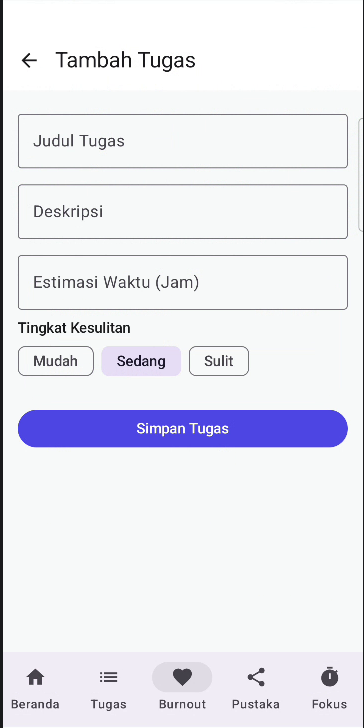
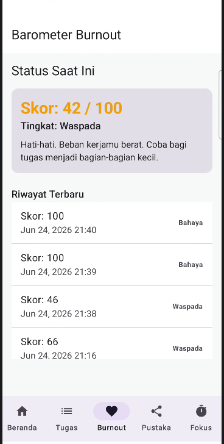
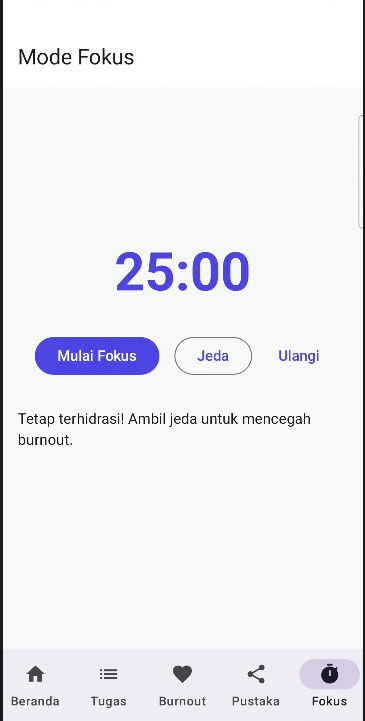
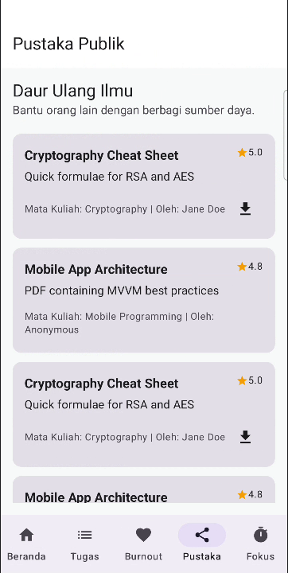

# TaskBin 📚🧠

TaskBin adalah sebuah aplikasi manajemen tugas (To-Do List) cerdas berbasis Android yang dirancang khusus untuk mahasiswa. Tidak hanya sekadar mencatat tugas, TaskBin berfokus pada **produktivitas dan kesehatan mental (well-being)** penggunanya. Aplikasi ini dilengkapi dengan integrasi AI (Google Gemini) untuk menganalisis pola kerja pengguna dan memprediksi serta mencegah *burnout*.

Aplikasi ini dikembangkan sebagai Projek Ujian Akhir Semester (UAS).

---

## 🌟 Fitur Utama

1. **📚 Course & Task Management**
   - Catat dan kelola jadwal mata kuliah.
   - Tambahkan tugas dengan *deadline* spesifik.

2. **⏱️ Focus Session (Pomodoro Timer)**
   - Fitur penghitung waktu fokus (*focus timer*) untuk membantu sesi belajar lebih terstruktur.
   - Terdapat waktu jeda istirahat untuk menjaga fokus.

3. **🧠 AI Burnout Prediction (Powered by Gemini)**
   - Sistem akan menganalisa riwayat sesi fokus dan tumpukan tugas Anda.
   - Menggunakan AI untuk memprediksi tingkat stres/kelelahan mental (*burnout*) dan memberikan saran *recovery* yang terpersonalisasi.

4. **🌐 Public Knowledge**
   - Ruang berbagi catatan dan materi pelajaran untuk saling berkolaborasi.

---

## 🛠️ Teknologi yang Digunakan

- **Bahasa Pemrograman:** [Kotlin](https://kotlinlang.org/)
- **UI Toolkit:** [Jetpack Compose](https://developer.android.com/jetpack/compose) (Modern Declarative UI)
- **Arsitektur:** MVVM (Model-View-ViewModel)
- **Local Database:** [Room Database](https://developer.android.com/training/data-storage/room)
- **Asynchronous Programming:** Kotlin Coroutines & Flow
- **Artificial Intelligence:** [Google Gemini API](https://ai.google.dev/) (Server-Side Integration)

---

## 🚀 Cara Menjalankan Project (Local Setup)

Untuk menjalankan proyek ini di mesin lokal (Android Studio), ikuti langkah-langkah berikut:

### Prasyarat
- **Android Studio** (Versi terbaru direkomendasikan)
- Akun Google / Google AI Studio untuk mendapatkan API Key Gemini.

### Instalasi

1. **Clone Repository ini**
   ```bash
   git clone https://github.com/Hafiz931/UAS-PBM.git
   ```

2. **Buka Project di Android Studio**
   Pilih `File` > `Open` dan arahkan ke direktori hasil *clone*.

3. **Konfigurasi API Key**
   - Dapatkan Gemini API Key Anda dari [Google AI Studio](https://aistudio.google.com/app/apikey).
   - Buat sebuah file bernama `.env` di *root* direktori proyek (sejajar dengan `app/`, `build.gradle.kts`, dll).
   - Tambahkan API Key Anda di file `.env` tersebut dengan format berikut:
     ```env
     GEMINI_API_KEY=masukkan_api_key_anda_di_sini
     ```

4. **Sinkronisasi Gradle & Jalankan**
   - Tunggu Android Studio menyelesaikan *Gradle Sync*.
   - Jalankan (*Run*) aplikasi menggunakan Emulator atau Perangkat Fisik (Android).

---

## 📱 Tampilan Aplikasi (Screenshots)

<div align="center">
  
  &nbsp;&nbsp;&nbsp;
  
  &nbsp;&nbsp;&nbsp;
  
  &nbsp;&nbsp;&nbsp;
  
  &nbsp;&nbsp;&nbsp;
  
  &nbsp;&nbsp;&nbsp;
  
  &nbsp;&nbsp;&nbsp;
</div>

---
